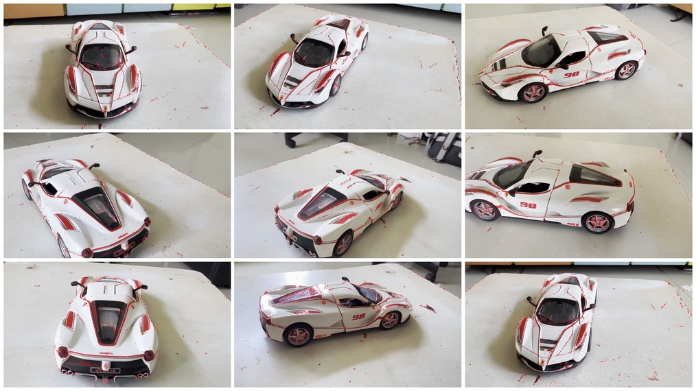
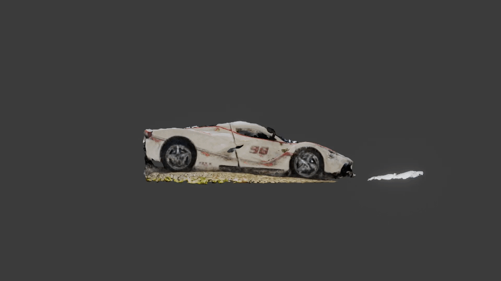
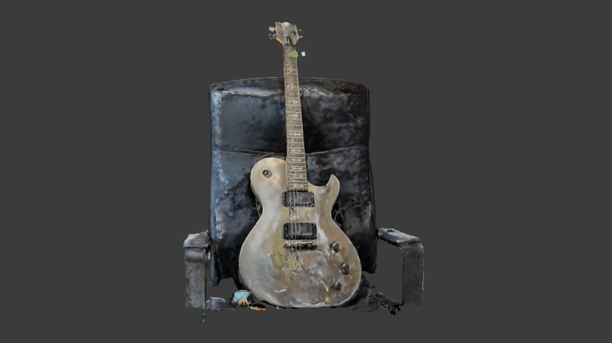
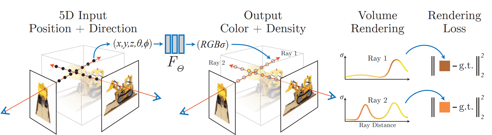
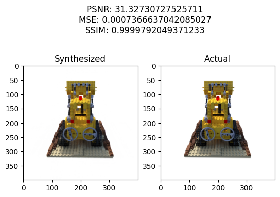
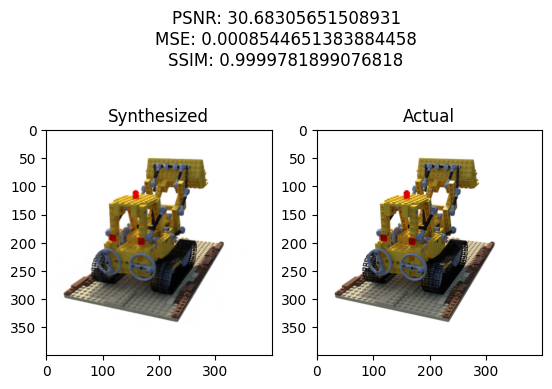
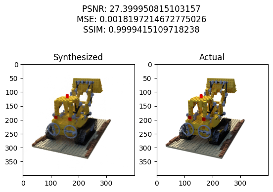
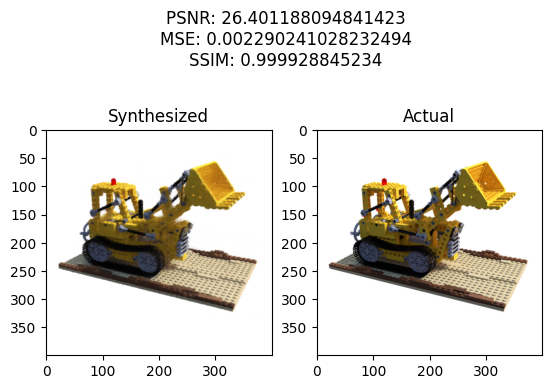
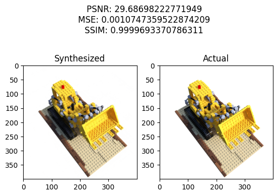

# NeRF-KPlanes-SemX

 An implementation and explanantion of NeRF and K-Planes in PyTorch. This repository contains the code for NeRF and K-Planes for my Semester X Neural Networks and Deep Learning Project. A **report** has also been generated explaining in detail the models implemented, the metrics and dataset used and the libraries and open-source software leveraged. It is based on the implementation of **Maxime Vandegar** [(@Papers in 100 Lines of Code).](https://github.com/MaximeVandegar/Papers-in-100-Lines-of-Code/tree/main/NeRF_Representing_Scenes_as_Neural_Radiance_Fields_for_View_Synthesis)

| Input Data  | Pre-Processing (Colmap Based) | Output |
| -------- | ------- | ------- |
|  |  |   |

**[Notebook Explaing Full Pipeline](./full_pipe.ipynb)**

**[Report](./report/)**

Also check out **[Maxime's Course on Udemy](https://www.udemy.com/course/neural-radiance-fields-nerf/?referralCode=DD33817D57404AF048DF)**.

⚠️ Gifs may Fail to Render, All assets available in [img](./img/) directory.

## High Fidelity Outputs (Using NeRFStudio)

Animations made using Blender

| Guitar  | Shoe | Model Car|
| -------- | ------- | ------- |
|  |  |   |

[NeRF Studio Instructions](https://docs.nerf.studio/quickstart/first_nerf.html)

## Models Implemented

### NeRF Model

[Code](./backbones/nerf.py)

### K-Planes Model

[Code](./backbones/kplanes.py)

Refer to [Report](./report/) for detailed explanation.

## Data Used

We have used the lego directory of the blender dataset. Pre-processed dataset can be found here [@Papers in 100 Lines of Code.](https://github.com/MaximeVandegar/Papers-in-100-Lines-of-Code/tree/main/NeRF_Representing_Scenes_as_Neural_Radiance_Fields_for_View_Synthesis)

### Custom Data

For custom data, we have used NeRF studio to make our renders. Instructions for creation and processing of custom data can be found here [NeRF Studio Instructions](https://docs.nerf.studio/quickstart/first_nerf.html) as well as detailed explanation for data acquistion can be found here [Report](./report/).

## Results

| NeRF | K-Planes |
| -------- | ------- |
|  |  |
|  |  |
|  |  |
|  |  |

### Averaged Metrics

| Metric | NeRF | K-Planes |
| -------- | ------- |  ------- |
| **MSE** | 29.92 | **26.63** |
| **PSNR** | **0.0010** | 0.0022 |
| **SSIM** | **0.99** | 0.99 |
| **Render Time** | 10.13s | **3.90s** |

All testing has been performed on synthetic blender data.

## Repository Structure

### Directories

* report - Detailed report about project.
* img - Assets for readme.
* backbones - Scripts for NeRF and K-Planes.
* scraps - Notebook experimenting with Ray Tracing and Rendering.
* utils - Basic image utils.

### Scripts

* train.py - Training NeRF model.
* test.py - Novel View synthesis.
* evaluate.py - Metricced Novel View Synthesis.
* full_pipe.ipynb - Complete pipeline demo notebook.
